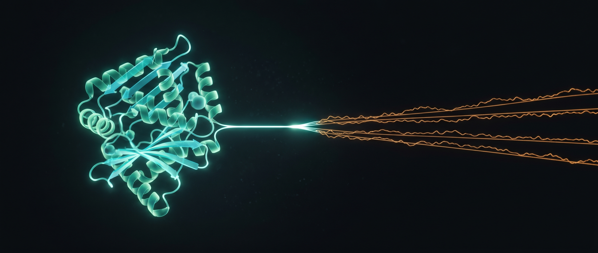
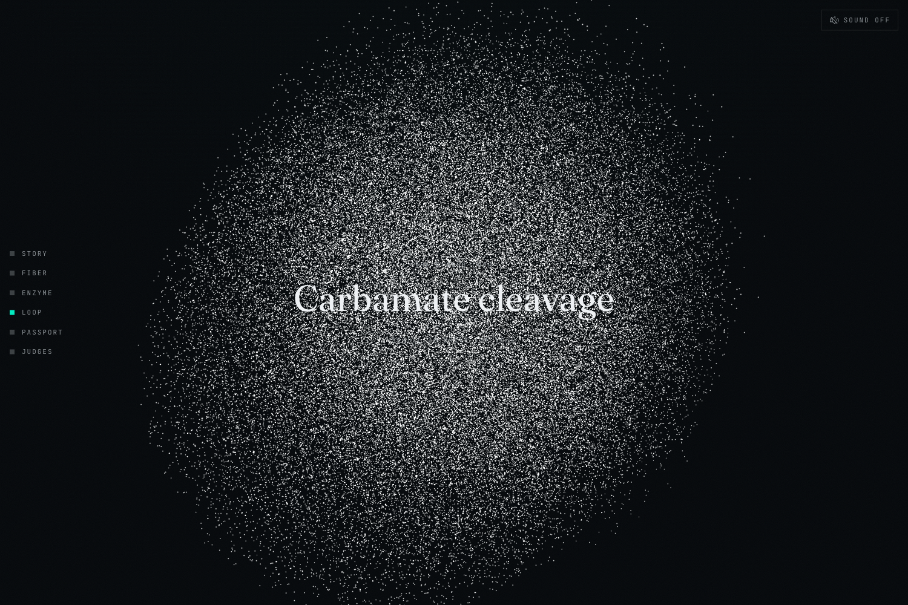
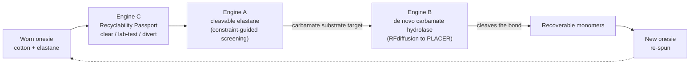
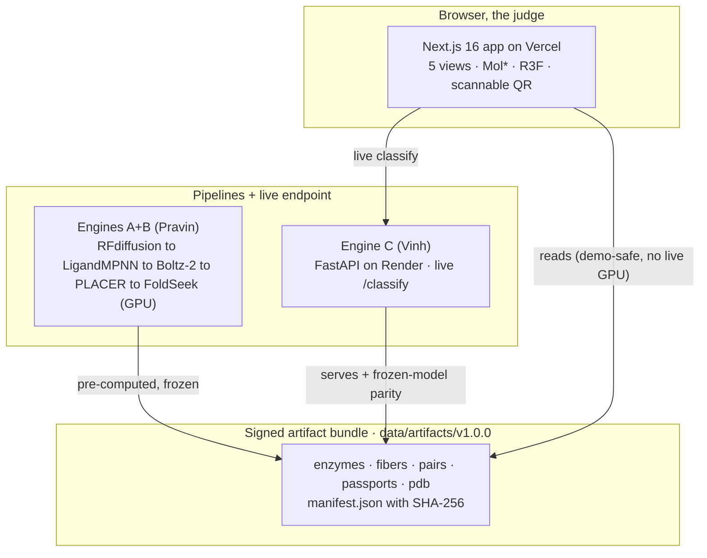

<p align="center">
  
</p>

# REWEAR-FUSED

**Safe to wear, able to be remade.**

REWEAR-FUSED closes the textile-to-textile recycling loop on children's stretch apparel. It co-designs two matched molecules at once: a new, enzymatically-cleavable elastane fiber, and the de novo enzyme designed from scratch to cleave it. Around that loop sits a deployable Digital Recyclability Passport that proves each garment is safe and routes it to the right end-of-life.

Built for the Cox Enterprises **"Play With Purpose"** Sustainability Hackathon, Carter's **Making & Remaking** track.

<p align="center">
  
  
  
  
  
  
</p>
<!-- On June 14, after the public repo + deploy exist, add the live badges here:
  [](https://github.com/StephenSook/<repo>/actions/workflows/ci.yml)
  [](<vercel url>)
-->

> Everything REWEAR-FUSED produces is an **in-silico design with benchmark-referenced metrics**, not a wet-lab-validated material or enzyme. Every number traces to a real pipeline output or a verified citation. No synthetic data, no fictional persona. The honesty is on a [`/judges`](frontend/src/app/judges/page.tsx) page that tiers exactly what is real.

## The problem

Carter's already collects worn baby clothes through KIDCYCLE, then shreds them into insulation and pet bedding, because two walls stop a onesie from ever becoming a onesie again.

- **Wall 1, chemical safety.** Nobody can prove the recovered fabric is chemically safe for infant skin.
- **Wall 2, elastane.** Nobody can break down the elastane woven into every stretch garment.

Elastane is in about **80%** of all clothing, and as little as **1%** of it makes a textile recycler reject the whole garment. Only about **1%** of garments are recycled fiber-to-fiber today. REWEAR-FUSED knocks down both walls.

## REWEAR-FUSED in one loop

> A worn onesie enters. The passport proves it is safe and routes it. We design a new cleavable elastane, design a matched enzyme against its exact bond, the enzyme cleaves it to recoverable monomers, and it re-spins into a new onesie. Neither the molecule nor the enzyme existed 72 hours ago.

<p align="center">
  <br>
  <em>The closed loop, scrubbed by scroll, at the carbamate-cleavage moment where the two accents fuse.</em>
</p>

## What it does

- **Engine A, Cleavable Elastane Design.** Constraint-guided virtual screening of polyurethane-urea chemical space. Aliphatic isocyanates only (so nothing carcinogenic comes off near a baby), the cleavable bond in the amorphous soft segment (so the stretch survives), 25 to 35 percent hard segment. It emits the carbamate microenvironment as the enzyme's substrate target.
- **Engine B, De Novo Carbamate Hydrolase.** An enzyme designed from scratch (RFdiffusion to LigandMPNN to Boltz-2 to PLACER to FoldSeek) to cleave the exact bond in Engine A's fiber, with an engineered near-neutral Ser-His-Asp triad so it does not damage companion cotton. Anchored on, not copied from, the published UMG-SP2 urethanase transition-state geometry.
- **Engine C, Digital Recyclability Passport.** A live compliance classifier that routes each garment **clear / lab-test / divert** against real US and EU regulation (CPSIA, California PFAS law, REACH, OEKO-TEX, EU ESPR) and emits a scannable GS1 Digital Link / EU Digital Product Passport. The part Carter's could deploy in Year 1.

## Architecture

REWEAR-FUSED is one inverse-design loop, two coupled molecules. Rather than attack today's crystalline elastane (which defeats every enzyme), it redesigns the fiber to be cleavable and designs the enzyme to match.



The product is wired so the live demo never depends on a real-time GPU job. The pipelines pre-compute signed artifacts; the deployed app renders them through real code; Engine C also runs live.



## What is real, what is in-silico

We would rather you check than take our word. The full tiering is the in-app [`/judges`](frontend/src/app/judges/page.tsx) page.

| Component | Tier | TRL | What it is |
|---|---|---|---|
| Engine C, the Passport | **WIRED LIVE** | 6 | a real FastAPI endpoint + the deployed UI; the Year-1 deployable product |
| The application (5 views) | **WIRED LIVE** | - | deployed on Vercel, reading the signed artifact bundle through real code |
| Training + reference data | **REAL DATA** | - | CPSC Recalls, EU Safety Gate, Toxic-Free Future / Peaslee PFAS, OEKO-TEX |
| Engine A, the fiber | **IN-SILICO** | 3 | constraint-guided screening; predicted properties with benchmark-referenced confidence |
| Engine B, the enzyme | **IN-SILICO** | 2 | de novo design; PLACER preorganization + FoldSeek novelty on the Lauko thresholds |
| Wet-lab validation | **FORWARD** | - | not done in 72 hours; the Cox Cleantech Residency ask |

## The five views

| | View | What it shows |
|---|---|---|
| 01 | **Story** | the two walls and the verified stats, as a scroll-driven cold open |
| 02 | **Passport** | garment intake, the clear/lab-test/divert router with citations, the scannable QR |
| 03 | **Fiber** (Engine A) | the screening funnel, the candidate, and the mechanics-vs-cleavability trade-off curve |
| 04 | **Enzyme** (Engine B) | the Mol\* structure with the Ser-His-Asp triad, the PLACER metric, the FoldSeek badge |
| 05 | **Loop** | the GPU particle storm: onesie to cleavage to monomers to a new onesie, scrubbed by scroll |

Screens in [`docs/gallery/`](docs/gallery).

## Quickstart

```bash
# Frontend (Next.js 16, webpack bundler for Mol* compatibility)
cd frontend && npm install && npm run dev      # http://localhost:3000

# Engine C, the live passport endpoint
cd engine-c && python -m venv .venv && source .venv/bin/activate
pip install -r requirements.txt && pytest -q
uvicorn api.main:app --port 8000               # GET /healthz, /classify/{id}, /passport/{id}

# Regenerate the artifact manifest (SHA-256 per file)
python scripts/build_manifest.py
```

Engines A and B run on a rented GPU (RunPod); see [`docs/pravin_handoff.md`](docs/pravin_handoff.md). Deploy and the June-14 plan are in [`docs/deploy.md`](docs/deploy.md) and [`docs/event_runbook.md`](docs/event_runbook.md).

## Project layout

```
frontend/      Next.js 16 + React 19 + Mol* + R3F. The five views + the scroll shell + /judges.
backend/       Engines A + B molecular pipelines (Pravin) + the artifact server.
engine-c/      Engine C: the compliance classifier, the passport, the live FastAPI endpoint (Vinh).
data/          The versioned, SHA-256-signed artifact bundle the frontend reads. The data contract.
scripts/       build_manifest.py, init_event_repo.sh.
docs/          Architecture, lane handoffs, the demo script, the DevPost text, the gallery, the runbook.
CLAUDE.md      The full build specification + the operating contract.
PLAN.md        The team coordination system.
```

## Built with

Next.js 16, React 19, TypeScript, Tailwind v4, Mol\* 5.9, three.js r184, React Three Fiber 9, GSAP, Lenis, visx, FastAPI, Python 3.12, Render, Vercel, RDKit, RFdiffusion, LigandMPNN, Boltz-2, PLACER, FoldSeek, CatBoost, GS1 Digital Link, W3C Verifiable Credentials.

## Responsible AI and honesty

REWEAR-FUSED is decision support and a design tool, not a validated material or a medical claim. Everything is in-silico at TRL 2-3 and labeled as such on every predicted-property panel. Engine C trains on real public data only; no synthetic data reaches the judged path. Demo garments are real Carter's product archetypes with real published compositions, and no fictional persona is used. Aliphatic-only chemistry is enforced so no aromatic carcinogen can be released. Every claim is checkable in the code and on the [`/judges`](frontend/src/app/judges/page.tsx) page.

## License

[Apache-2.0](LICENSE).
